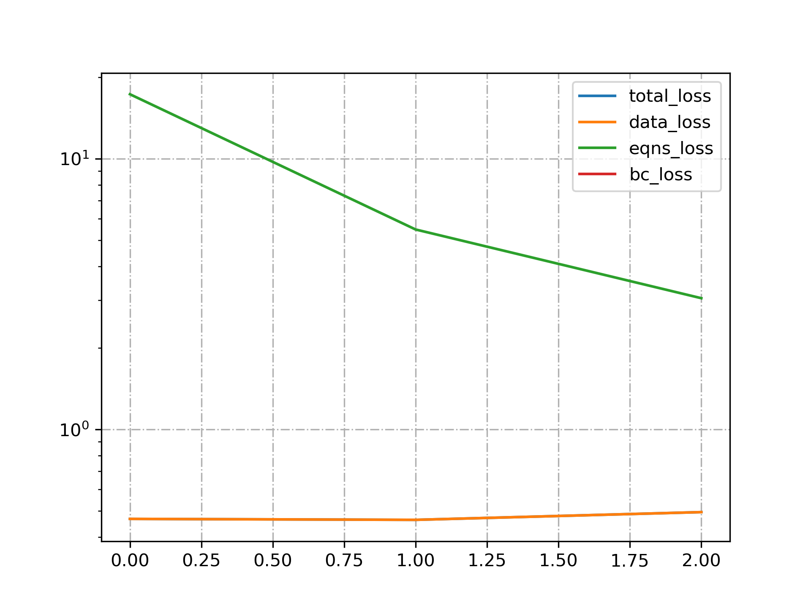

<div align="center">

# 🌊 PINN-3D-Flow-Solver

### Physics-informed neural network for 3D flows.

Solve the 3D Navier-Stokes equations with PINNs — physics-law-driven, data-augmented, GPU-friendly.

[](LICENSE)
[](https://www.python.org/)
[](https://pytorch.org/)

</div>

---

**PINN-3D-Flow-Solver** implements a **physics-informed neural network (PINN)** solver for the **3D Navier-Stokes equations**, simulating complex fluid flows by fusing physical laws with data — a lightweight (~3.5MB model) alternative to costly CFD.

> [!NOTE]
> 中文项目：基于物理信息神经网络（PINN）的 3D 流场求解器——求解 Navier-Stokes 方程，物理约束 + 数据驱动，模型仅 ~3.5MB。

---

## Features

- **PINN solver** — physics-informed 3D Navier-Stokes solving.
- **Lightweight** — ~3.5MB model, runs on ordinary GPUs.
- **Hybrid** — fuses physical laws with data-driven learning.
- **Applications** — aerospace, automotive, energy flow simulation.

---

## Quickstart

```bash
git clone https://github.com/Windyhhh/PINN-3D-Flow-Solver.git
cd PINN-3D-Flow-Solver

pip install -r requirements.txt

python src/train.py          # train the PINN
python src/solve.py          # solve a 3D flow field
```

---

## Project Structure

```
PINN-3D-Flow-Solver/
├── src/
│   ├── pinn.py              # PINN model
│   ├── train.py
│   └── solve.py
├── configs/
└── docs/                    # quick start, structure, blog
```

---


## Results

<div align="center">
  
</div>

---
## License

MIT — free to use, modify and distribute.
