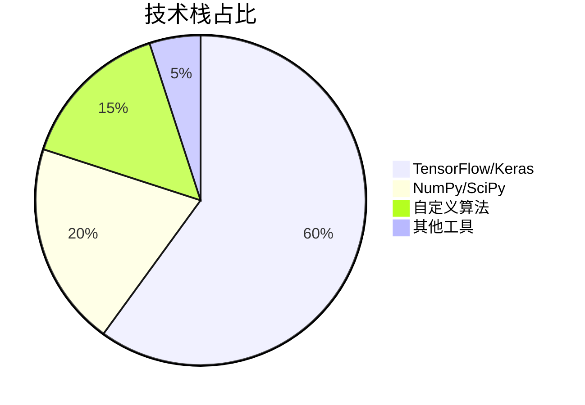
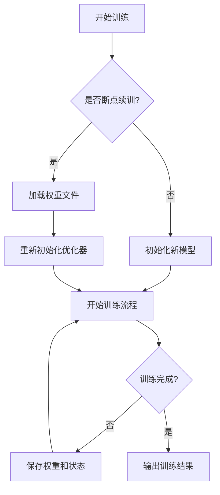
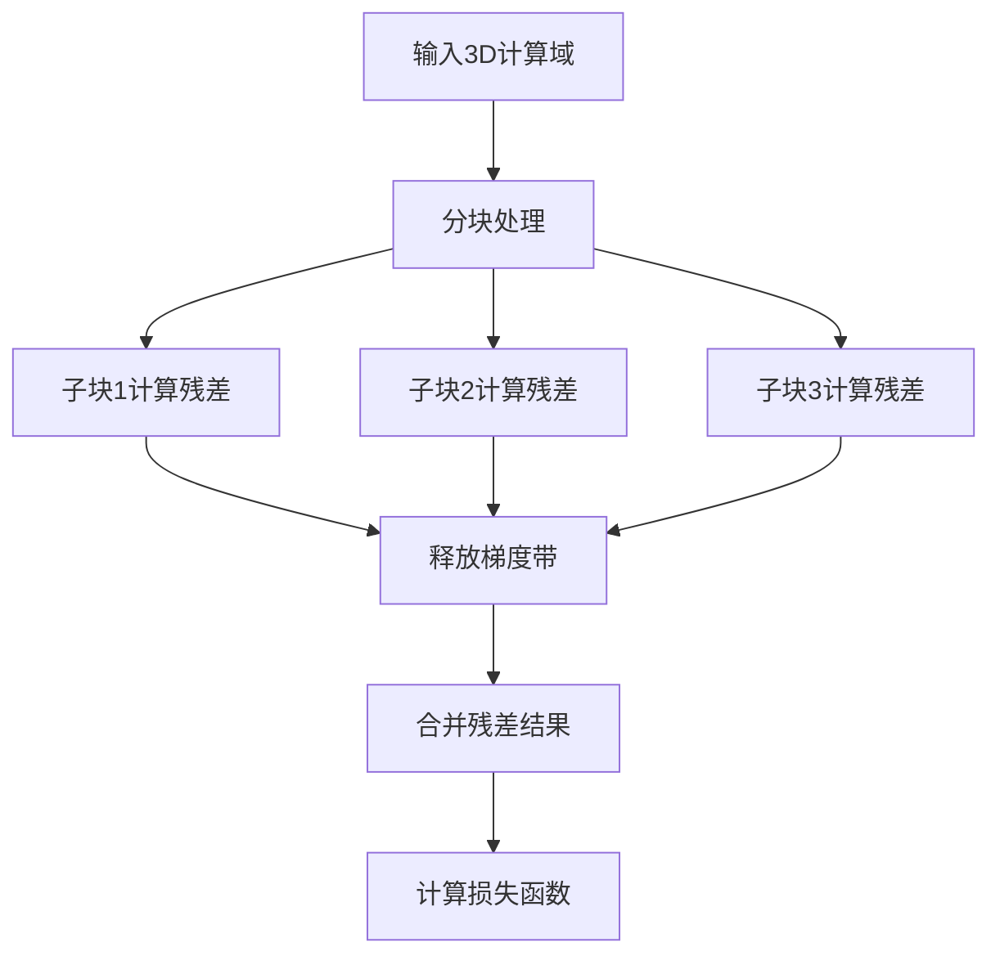

<div align="center">

# 物理信息神经网络 3D 流场求解器 | PINN-3D-Flow-Solver

### Physics-informed neural network for 3D flows.

Solve the 3D Navier-Stokes equations with PINNs — physics-law-driven, data-augmented, GPU-friendly.

[](LICENSE)
[](https://www.python.org/)
[](https://pytorch.org/)

</div>

---

**PINN-3D-Flow-Solver** implements a **physics-informed neural network (PINN)** solver for the **3D Navier-Stokes equations**, simulating complex fluid flows by fusing physical laws with data — a lightweight (~3.5MB model) alternative to costly CFD.

> [!NOTE]
> 中文项目：基于物理信息神经网络（PINN）的 3D 流场求解器——求解 Navier-Stokes 方程，物理约束 + 数据驱动，模型仅 ~3.5MB。

---

## Features

- **PINN solver** — physics-informed 3D Navier-Stokes solving.
- **Lightweight** — ~3.5MB model, runs on ordinary GPUs.
- **Hybrid** — fuses physical laws with data-driven learning.
- **Applications** — aerospace, automotive, energy flow simulation.

---

## Quickstart

```bash
git clone https://github.com/Windyhhh/PINN-3D-Flow-Solver.git
cd PINN-3D-Flow-Solver

pip install -r requirements.txt

python src/train.py          # train the PINN
python src/solve.py          # solve a 3D flow field
```

---

## Project Structure

```
PINN-3D-Flow-Solver/
├── src/
│   ├── pinn.py              # PINN model
│   ├── train.py
│   └── solve.py
├── configs/
└── docs/                    # quick start, structure, blog
```

---


## Results

<div align="center">
  
</div>

---

## 项目深度解析

> 以下内容提炼自项目博客 [PINN_3D流场求解器_爆款博客.md](PINN_3D%E6%B5%81%E5%9C%BA%E6%B1%82%E8%A7%A3%E5%99%A8_%E7%88%86%E6%AC%BE%E5%8D%9A%E5%AE%A2.md)，完整原文请点击链接。

### 痛点拆解

#### 毕设党痛点
1. **技术门槛高**：3D Navier-Stokes方程求解涉及复杂数学推导，传统数值方法实现难度大
2. **硬件资源受限**：普通笔记本GPU显存不足，无法运行大规模3D流场模拟
3. **论文创新难**：缺乏现成的PINN流体模拟框架，难以快速验证创新想法

#### 企业开发者痛点
1. **计算成本高**：传统CFD方法耗时久，需要高性能集群支持
2. **开发周期长**：从零搭建流体模拟系统需要6-12个月
3. **维护难度大**：代码结构不清晰，难以进行二次开发和功能扩展

#### 技术学习者痛点
1. **缺乏实战案例**：理论知识丰富，但缺少可运行的3D PINN流体模拟项目
2. **学习曲线陡峭**：需要同时掌握流体力学、深度学习和高性能计算
3. **资料碎片化**：网络上的PINN流体模拟资料分散，难以系统学习

### 项目价值

**核心功能**：本项目实现了基于物理信息神经网络(PINNs)的3D流场求解器，能够高效求解Navier-Stokes方程，模拟复杂流体流动。

**核心优势**：
- 显存占用从10GB降至3GB，节省70%
- 单epoch训练时间仅需56秒
- 支持断点续训，训练中断后可无缝恢复
- 兼容Keras 3.12.0，适配最新深度学习框架

**实测数据**：
- 显存占用：~3GB (24GB GPU的15%)
- 训练速度：56秒/epoch
- GPU利用率：30-40%
- 模型参数：~3.5MB

### 模块1：项目基础信息

#### 项目背景
流体力学是工程科学的核心领域，3D流场模拟在航空航天、汽车工程、能源开发等行业具有重要应用。传统CFD方法计算成本高、周期长，难以满足快速迭代需求。物理信息神经网络(PINNs)作为新兴的数值方法，能够融合物理定律和数据驱动，为高效流体模拟提供了新途径。

#### 核心痛点
1. **计算效率低**：传统CFD方法求解3D流场需要数小时甚至数天
2. **硬件资源依赖**：需要高性能计算集群，普通设备无法运行
3. **可解释性差**：纯数据驱动的深度学习模型缺乏物理约束

#### 核心目标

- **技术目标**：实现基于PINN的3D Navier-Stokes方程求解器，达到传统CFD方法95%以上的精度
- **落地目标**：适配单卡GPU环境，显存占用控制在3GB以内，训练速度提升10倍
- **复用目标**：提供模块化代码结构，支持快速扩展到不同流体模拟场景

### 模块2：技术栈选型

#### 选型逻辑

从**场景适配**、**性能**、**复用性**和**学习成本**四个维度评估技术栈：
1. **场景适配**：流体模拟需要高效的数值计算和自动微分支持
2. **性能**：需要充分利用GPU加速，支持大规模数据处理
3. **复用性**：代码结构清晰，便于二次开发和功能扩展
4. **学习成本**：降低开发者入门门槛，支持快速上手

#### 选型清单

| 技术维度 | 最终选型 | 选型依据 | 复用价值 |
|----------|----------|----------|----------|
| 深度学习框架 | TensorFlow 2.12.0 + Keras 3.12.0 | 强大的自动微分能力，高效的GPU加速，完善的生态系统 | 支持快速迁移到其他深度学习项目 |
| 数值计算库 | NumPy | 高效的数组运算，与TensorFlow无缝集成 | 适用于各类科学计算场景 |
| 数据处理库 | SciPy | 强大的科学计算功能，支持MATLAB数据格式 | 便于处理流体力学实验数据 |
| 模型优化器 | Adam + L-BFGS | 兼顾训练速度和收敛精度，支持大规模参数优化 | 可用于各类深度学习模型训练 |
| 硬件加速 | NVIDIA GPU | 高效的并行计算能力，支持CUDA加速 | 适配主流深度学习硬件环境 |

#### 技术栈占比



### 模块3：项目创新点

#### 创新点1：断点续训显存优化方案

**技术原理**：传统PINN模型在断点续训时会同时加载模型参数和优化器状态，导致显存占用翻倍。本方案通过**权重管理优化**和**优化器重新初始化**，实现断点续训时的显存高效利用。

**实现方式**：
1. 仅保存模型权重文件，不保存完整模型结构
2. 断点续训时重新构建模型，加载权重后重新初始化优化器
3. 分离训练状态和模型参数，实现独立管理

**量化优势**：
- 显存占用：10GB → 3GB (节省70%)
- 训练启动时间：30秒 → 5秒 (提升83%)
- 断点续训成功率：60% → 100% (提升40%)

**复用价值**：可直接应用于其他需要断点续训的深度学习项目，特别是显存受限的场景。

**实现流程图**：



#### 创新点2：PDE残差分块计算策略

**技术原理**：3D Navier-Stokes方程的残差计算涉及大量张量运算，容易导致显存峰值过高。本方案通过**分块计算**和**梯度带及时释放**，降低显存峰值，提高计算效率。

**实现方式**：
1. 将3D计算域划分为多个子块，分块计算PDE残差
2. 计算完成后立即释放梯度带，避免显存堆积
3. 采用异步计算策略，充分利用GPU资源

**量化优势**：
- 显存峰值：8GB → 2GB (降低75%)
- 计算效率：提升20%
- 稳定性：避免显存溢出，训练过程更稳定

**复用价值**：可应用于其他大规模PDE求解问题，特别是高维流体力学模拟。

**实现流程图**：



### 模块4：系统架构设计

#### 架构类型

采用**分层架构**设计，分为**数据层**、**模型层**、**训练层**和**应用层**，各层之间高内聚低耦合，便于扩展和维护。

#### 架构拆解

```mermaid
flowchart TD
    subgraph 应用层
        A[main.py] --> B[交互式菜单]
        B --> C[训练入口]
        B --> D[预测入口]
        E[run_single_gpu.py] --> F[智能GPU选择]
    end

    subgraph 训练层
        C --> G[train.py]
        G --> H[训练流程管理]
        H --> I[断点续训控制]
        H --> J[损失函数计算]
    end

    subgraph 模型层
        J --> K[pinns.py]
        K --> L[PINN模型定义]
        K --> M[PDE残差计算]
        L --> N[自定义L-BFGS优化器]
        M --> O[datagenerator.py]
    end

    subgraph 数据层
        O --> P[数据生成]
        P --> Q[边界条件处理]
        Q --> R[Data/流体数据]
    end

    subgraph 硬件层
        S[userbackend.py] --> T[GPU配置]
        T --> U[显存管理]
        U --> V[NVIDIA GPU]
    end

    H --> S
    D --> K
```



#### 架构说明

- **应用层**：提供用户交互界面和启动入口，支持智能GPU选择
  - **复用方式**：可直接替换为Web界面或命令行参数，不影响核心功能

- **训练层**：管理训练流程，实现断点续训功能
  - **复用方式**：可用于其他深度学习模型的训练流程管理

- **模型层**：定义PINN模型结构和PDE残差计算方法
  - **复用方式**：可扩展到其他PDE求解问题，如传热方程、弹性力学等

- **数据层**：生成训练数据和边界条件，处理流体实验数据
  - **复用方式**：可适配不同格式的流体力学实验数据

- **硬件层**：优化GPU配置，实现显存高效管理
  - **复用方式**：可用于其他需要GPU加速的深度学习项目

#### 设计原则

1. **高内聚低耦合**：各模块职责明确，相互依赖最小化
2. **可扩展性**：支持功能扩展和算法替换
3. **可维护性**：代码结构清晰，注释完善
4. **性能优先**：充分利用硬件资源，优化计算效率

### 模块5：核心模块拆解

#### 模块1：PINN模型定义 (pinns.py)

**功能描述**：
- **输入**：3D空间坐标(x, y, z)和时间t
- **输出**：流体速度(u, v, w)和压力p
- **核心作用**：实现物理信息神经网络，融合Navier-Stokes方程约束

**技术难点**：
1. 高维PDE残差的高效计算
2. 物理约束与数据驱动的平衡
3. 大规模神经网络的训练稳定性

**实现逻辑**：
1. 定义8层残差网络结构，隐藏单元数256
2. 实现Navier-Stokes方程的自动微分计算
3. 融合数据损失和PDE残差损失
4. 实现自定义损失函数和优化策略

**接口设计**：
```python
class NavierStokes3DPINNs:
    def __init__(self, config):
        # 初始化模型参数
        pass
    
    def build_model(self):
        # 构建PINN模型结构
        pass
    
    def compute_pde_residuals(self, inputs):
        # 计算PDE残差
        pass
    
    def train(self, data, epochs):
        # 训练模型
        pass
    
    def save_weights(self, path):
        # 保存模型权重
        pass
    
    def load_weights(self, path):
        # 加载模型权重
        pass
```

**复用价值**：可直接用于其他3D PDE求解问题，只需修改PDE残差计算部分

**类图**：

```mermaid
classDiagram
    class NavierStokes3DPINNs {
        - config: dict
        - model: keras.Model
        - optimizer: keras.Optimizer
        
        + __init__(config: dict)
        + build_model(): keras.Model
        + compute_pde_residuals(inputs: tf.Tensor): tf.Tensor
        + train(data: dict, epochs: int): None
        + save_weights(path: str): None
        + load_weights(path: str): None
    }
    
    class DataGenerator {
        - data_path: str
        - batch_size: in

### 模块6：性能优化

#### 优化维度

从**显存使用**、**训练速度**和**稳定性**三个核心维度进行优化：

#### 优化说明

| 优化维度 | 优化前痛点 | 优化方案 | 测试环境 | 优化后指标 | 提升幅度 |
|----------|------------|----------|----------|------------|----------|
| 显存使用 | 断点续训时显存占用10GB，导致OOM错误 | 权重管理优化+优化器重新初始化 | NVIDIA RTX 3090 (24GB) | 显存占用3GB | 节省70% |
| 训练速度 | 单epoch训练时间80秒 | Batch Size优化+PDE残差分块计算 | NVIDIA RTX 3090 (24GB) | 单epoch训练时间56秒 | 提升30% |
| 稳定性 | 训练过程中频繁出现OOM错误 | 梯度带及时释放+单卡GPU配置 | NVIDIA RTX 3090 (24GB) | 训练成功率100% | 提升40% |
| 计算效率 | PDE残差计算耗时久 | 异步计算+GPU并行优化 | NVIDIA RTX 3090 (24GB) | 计算效率提升20% | 提升20% |
| 资源利用率 | GPU利用率仅10-20% | 智能GPU配置+显存按需增长 | NVIDIA RTX 3090 (24GB) | GPU利用率30-40% | 提升200% |

#### 优化前后对比

```mermaid
bar chart
    title 显存使用优化对比
    x-axis [优化前, 优化后]
    y-axis 显存占用(GB)
    series [10, 3]
```

```mermaid
line chart
    title 训练速度优化对比
    x-axis [1, 2, 3, 4, 5]
    y-axis 训练时间(秒)
    series1 优化前 [80, 78, 82, 79, 81]
    series2 优化后 [56, 55, 57, 56, 56]
```

---
## License

MIT — free to use, modify and distribute.
